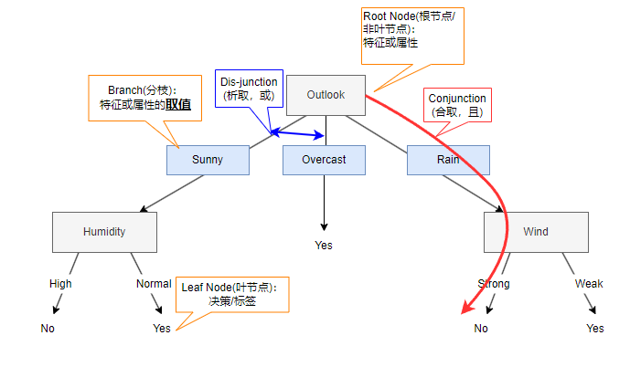
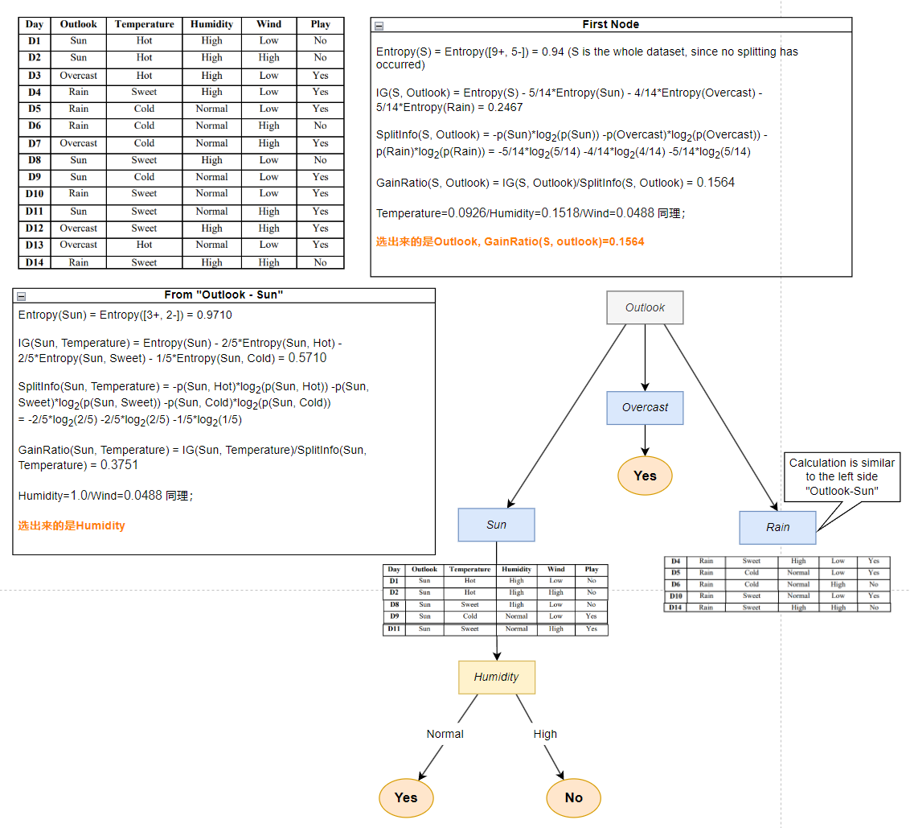
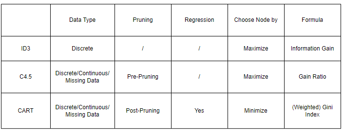

# Decision Tree  

References:  
[A comparative study of decision tree ID3 and C4.5](https://saiconference.com/Downloads/SpecialIssueNo10/Paper_3-A_comparative_study_of_decision_tree_ID3_and_C4.5.pdf)

## 1. Classical target problem for decision tree learning：
    * Classification problems with non-numeric features;
    * Classification problems with discrete features;
    * No need of considering similarity between attributes/features;
    * No order in features; such as [male, female] in real life, there is no priority among these two classes.  
   
For continuous features, we need to first discrete the values before flushing the features into the training. Common 
techniques can be seen from [Data Discretization](./discretization.md).  

**Decision trees make decisions based on discrete attribute partitions, so if a feature is textual, we do
not need to pre-process it to discrete numeric values.**   

<mark>Decision-tree algorithms are known to be unstable: small variations in the training set can result in different 
trees and different predictions for the same validation examples</mark>

---
## 2. Definition
  
决策树实际就是通过分支间的关系进行"或"或"且"的逻辑表达；  
也因为以上这个性质，决策树是机器学习中少有的、天生具有解释性和可解释性的方法。

*PS:模型的可解释性(Model interpretability): Interpretability is the degree to which a human can understand the cause of a 
decision, that is the reason the model makes such predictions.*  

Main operations in Decision Tree algorithm are:
* Splitting: divide the samples into subsets that contains possible values for the best attributes;
* Pruning: an efficient strategy to fight against over-fitting.  


---
## 3. Information Gain, Gain Ratio, Gini Impurity 

### 3.1 Entropy
Entropy can be used for both binary and multi-class classification problems.
是度量样本集合纯度最常用的一种指标。信息的混乱程度越大，不确定性越大，信息熵越大；对于纯度，就是信息熵越大，纯度越低。  
换句话说，如果集合里所有的样本都属于同一个类型，那么这个集合的纯度高，不确定性低，信息熵低。   
$$Entropy(N)=\sum_{i=1}^n P(w_{j})log_{2}P(w_{j})$$  
在二分类问题下的形式是:  
$$Entropy(S)=-p_{+}log_{2}p_{+}-p_{-}log_{2}p_{-}$$    
* S is a collection of training samples  
* $p_{+}$ is the proportion of positive samples in S
* $p_{-}$ is the proportion of negative samples in S  

<mark>Calculation Example</mark>  
* $Entropy([29+,35-])=-\frac{29}{64}\times log_{2}\frac{29}{64} - \frac{35}{64}\times log_{2}\frac{35}{64}$
* <mark>$Entropy([14+,0-])=-\frac{14}{14}\times log_{2}\frac{14}{14} - \frac{0}{14}\times log_{2}\frac{0}{14} = 0$</mark>   
* <mark>$Entropy([7+,7-])=-\frac{7}{14}\times log_{2}\frac{7}{14} - \frac{7}{14}\times log_{2}\frac{7}{14} = 1$</mark>   

```
def get_entropy(self, label: np.array) -> float:
    """
    Get entropy of the given label values, we only care about the positive and negative sample proportion 
    under the given attribute;
    label: [n*1] array for label values; based on current feature
    """
    # step 1: get occurence weights
    amount = len(list(label))
    label_class_counts = self.get_probability_count(label)  # [label=0 count, label=1 count]
    # step 2: use occurence weights to get entropy
    # if all count is 0, return 0; if all count is the same(but not zero), return 1;
    if all(class_count == label_class_counts[0] for class_count in label_class_counts):
        if label_class_counts[0] == 0:
            return 0.0
        else:
            return 1.0
    weights = [count/amount for count in label_class_counts]
    return -sum([w * np.log2(w) for w in weights if w > 0])
```

### 3.2 Information Gain  

ID3 chooses nodes that maximize the information gain to grow the tree 
由于对A的排序整理带来的熵的期望减少量。  
$$Gain(S,A)=Entropy(S)-\sum_{v \in Values(A)}^{} \frac{|S_{v}|}{|S|}Entropy(S_{v})$$    
等式右边第一项为“原始S的熵值”，第二项为“属性A分类以后得期望熵值”。  
   
<i>[image source](https://www.youtube.com/watch?v=y6VwIcZAUkI)</i>  

```
def get_IG(self, feature, label) -> List[Any]:
    """
    Calculate IG for different sub class values for a feature
    feature: [n*1] array for feature-to-be-split values
    label: [n*1] array for label values; based on current feature/feature's subclass(subnode)
    
    return:
    [IG, {feature_subclass(subnode): [indices]}]
    """
    
    current_entropy = self.get_entropy(label)  # entropy of a given feature

    # {feature_subclass(subnode): [indices]}, this is to help access sub class(node) of a given feature
    feature_index = {}
    for index, feature_value in enumerate(feature):
        if feature_value not in feature_index:
            feature_index[feature_value] = []
        feature_index[feature_value].append(index)

    # candidate split features' entropy (weighted)
    entropy = 0
    for key in feature_index.keys():
        label_values = label[feature_index[key]]
        entropy += self.get_entropy(label_values) * len(label_values)/len(label)
    return [current_entropy-entropy, feature_index]
```

<mark>注意一个自己学习时的误区！  
以上面的示例图为参考，IG实际是根据某一feature的各种取值的正负样例的probability计算的，
而不是某一feature的某个特定取值下其他feature的正负例的probability！</mark>


### 3.3 Gain Ratio  
An improvement based on Information Gain.   
The larger the information gain of a feature is, the greater ability this feature has on decreasing the uncertainty of
samples. With this logic, if there exists a feature and each of its attribute value is unique to a sample, the ID3 tree
will tend to use this feature to grow a tree with too many branches, and easily leads to overfit(or basically the 
classification makes no sense). E.g. If we use the 'Day' as a feature(image in section 3.2), then the information gain 
of each 'Day No.' could easily exceed all the other features, whilst day information is meaningless to make a 
classification decision.  

The solution to the above issue is to punish if a tree has too many branches. That is the reason for using gain ratio, 
instead of information gain.  

**Formular:**  
$$GainRatio(S,A)=\frac{IG(S,A)}{SplitInfo(S,A)}$$   
$$SplitInfo(S,A)=-\sum_{j=1}^{n} p^{'}(\frac{j}{p}) \times log_{2}(p^{'}(\frac{j}{p}))$$   
<mark>注意splitInfo的计算和entropy很像，但不是一样的！Split Info计算的是根据一个feature的不同取值在子集中的样例的比例，
而不是一个feature的某一取值下正负样例(二分类，其实就是label的种类的样本数量比)的比例。</mark>  

PS: Calculation example -> image in Section 4.2  


### 3.4 Gini Index
$$i(N)=\sum_{i \neq j}^{} P(w_{i})P(w_{j}) = 1-\sum_{j}^{} P^{2}(w_{j})$$  
假设集合N共有3个类型A,B,C,  
$$i(N) = P(A)*P(B) + P(A)*P(C) + P(B)*P(C) = 1-P^{2}(A)-P^{2}(B)-P^{2}(C)$$  
$$WeightedGini(S) = /sum_{i}^{} P_{i} \times i(S)$$  
其中,P_{i}是第i个类型的样本数量在S这个子集中的比例。  

在构建决策树时，通常选择Gini系数<mark>最小</mark>的节点作为分割点。


---
## 4. ID3, C4.5, CART  

### 4.1 ID3   
Implemented in recursive manner.  
ID3 uses the node(feature) with maximum information gain to grow the tree.  
  

Example of choosing nodes that maximize the information gain to grow the tree:  


    

<b>When to return(stop splitting)?</b>  
* All samples in the subset have the same label;
* All samples in the subset have the same feature value; For example, all the samples in the subset have value "green" 
under the feature "color", whilst not all of associated labels are "yes" or "no". <mark>Current information is not
enough to make a correct decision under a certain condition.</mark>

Note: 如果所有属性分裂的information gain均为0，意味着(1)数据有噪音(2)目前的特征选取的不够好，需要找到一些对于做决定比较重要的特征。


### 4.2 C4.5  

Same as ID3, C4.5 chooses nodes that maximize the gain ratio to grow the tree.
  

相较于ID3, C4.5可以处理连续数值（ID3必须离散）。实际上，C4.5对于连续数值也是离散化的方法，不过是通过gain ratio去计算了最佳分裂点。
可以参考
[C4.5连续值处理方法 & 常见连续值处理方法](https://blog.csdn.net/shushi6969/article/details/120227875?spm=1001.2101.3001.6661.1&utm_medium=distribute.pc_relevant_t0.none-task-blog-2%7Edefault%7EBlogCommendFromBaidu%7ERate-1-120227875-blog-51602976.235%5Ev43%5Econtrol&depth_1-utm_source=distribute.pc_relevant_t0.none-task-blog-2%7Edefault%7EBlogCommendFromBaidu%7ERate-1-120227875-blog-51602976.235%5Ev43%5Econtrol&utm_relevant_index=1)  
处理步骤为：  
1. 将特征取值升序排序；
2. 对于排序好的特征取值，计算第i个和第i+1个值之间的平均值；
3. 假设以第i个均值为分裂点，将数据集分成两部分，计算每个可能的分裂点的信息增益；
4. 选择信息增益最大的结果作为分裂点。


C4.5的另一个改进在缺失值的处理上。  
可以参考
[决策树（decision tree）（四）——缺失值处理](https://blog.csdn.net/u012328159/article/details/79413610?spm=1001.2101.3001.6661.1&utm_medium=distribute.pc_relevant_t0.none-task-blog-2%7Edefault%7EBlogCommendFromBaidu%7ERate-1-79413610-blog-46322815.235%5Ev43%5Econtrol&depth_1-utm_source=distribute.pc_relevant_t0.none-task-blog-2%7Edefault%7EBlogCommendFromBaidu%7ERate-1-79413610-blog-46322815.235%5Ev43%5Econtrol&utm_relevant_index=1)  
Based on the way C4.5 handles unknown data, another improvement of C4.5 is that it is able to use attributes with 
different weights.


### 4.3 CART(Classification and Regression Tree)
CART chooses nodes by <mark>minimizing</mark> the Gini Index.   
基尼系数越小，表示节点的不纯度越低，也就是说节点中的样本更加纯净。在构建决策树时，算法会选择使得基尼系数减小最多的分割点。  

[CART (Classification And Regression Tree) in Machine Learning](https://www.geeksforgeeks.org/cart-classification-and-regression-tree-in-machine-learning/)
Unlike ID3 and C4.5, CART can be used for regression. A Regression tree is an algorithm where the target variable is 
continuous and the tree is used to predict its value. Regression trees are used when the response variable is continuous. 
For example, if the response variable is the temperature of the day.

CART for regression is a decision tree learning method that creates a tree-like structure to predict continuous target 
variables. 


### 4.4 Comparison  
[一文搞懂决策树：ID3、C4.5、CART算法精讲](https://juejin.cn/post/7028783405902856228)  
[Survey of the Decision Trees Algorithms (CART, C4.5, ID3)](https://medium.com/@abedinia.aydin/survey-of-the-decision-trees-algorithms-cart-c4-5-id3-97df842831cd)  
  


---
## 5. Pruning  

There are pre-pruning and post-pruning.   
Pre-pruning: If the splitting is not statistically significant, stop the tree from growing;  
Post-pruning: Construct a tree and then prune branches.  

### Pre-pruning
<b>Type 1:</b>  
* 当一个节点的训练样本数小于训练集合的一个特定比例（例如5%,就是一个阈值）
* 基于过少数据样本的决定会带来较大误差和泛化错误，也就是说会过于局部

<b>Type 2:</b>
* 基于信息增益的阈值（换句话说，即使当前分支最大的IG对比之前的增益也不显著）
* 优点在于用到了所有的数据，叶节点可能在树中的任何一层
* 但是很难设定一个好的阈值  


### Post-pruning
Cost complexity pruning (post-pruning) steps:
1. Train your Decision Tree model to its full depth
2. Compute the ccp_alphas value using cost_complexity_pruning_path()
3. Train your Decision Tree model with different ccp_alphas values and compute train and test performance scores
4. Plot the train and test scores for each value of ccp_alphas values.


# Future Research
1. C4.5 Code Implementation
2. How to handle unknown data in the test set with C4.5?
3. [Improving Stability in Decision Tree Models](https://arxiv.org/abs/2305.17299) 
4. <mark>CART Regression Code</mark>
5. Random Forest (mentioned in Bagging later)
6. [Post Pruning Implementation](https://www.kdnuggets.com/2022/09/decision-tree-pruning-hows-whys.html)
