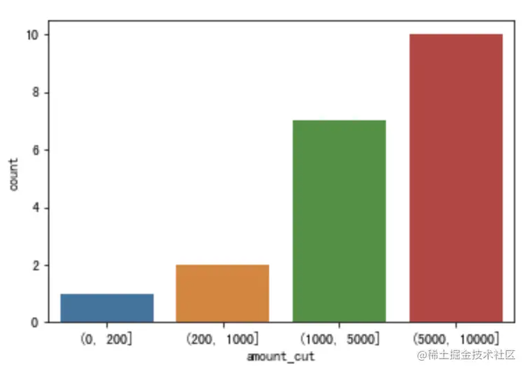
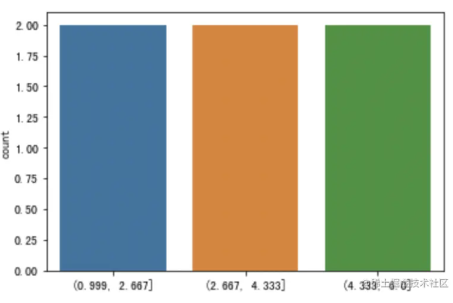

# Data Discretization（Binning分箱） 

[离散化方法汇总](https://juejin.cn/post/7030937879660462110)  

The most popular discretization algorithms are equal-width and equal-frequency discretization. These are unsupervised 
discretization techniques because they find the interval limits without considering the target. Using k-means to find 
the interval limits is another unsupervised discretization technique.   
In all these methods, the user needs to define the number of bins into which the continuous data will be sorted beforehand. 

Reasons to use binning:
* Needed by the algorithm, such as decision tree;
* Reduces computational complexity significantly since it eliminates redundant information from datasets; noise and randomness
could also be removed while binning. Therefore, model stability and robust could be improved;(简单来说, 离散化后的特征对异常数据有很强的鲁棒性).
* Improve the generalization capacity of a model;

Disadvantage of binning:
* Important information may be lost from the dataset due to the simplification;
* Outliers may not always be properly captured, resulting in incorrect results being produced if these anomalies remain 
undetected;
* Only limited numbers of categories are typically employed, any subtle nuances between different levels tend to become 
less visible;
* Affect the stability of a model; When a feature value is at the edge of a binning point, a slight deviation will cause 
the feature value to jump from one bin to another.

---

## Data Binning Approaches
Equal-width and equal frequency binning are the two most frequent used binning approaches in the data preprocessing. 

1. Equal-width Binning 等距分箱（即等宽）  
In practice, the number of bins is specified to divide the data sequence into n parts. If we discrete a data sequence x 
into n partitions, then the width between split point is: 
$\frac{max(x)-min(x)}{n}$  
We could use pandas [cut()](https://pandas.pydata.org/docs/reference/api/pandas.cut.html): `pd.cut(x, bins)`.  
**Equal-width discretization does not alter the variable distribution dramatically.**  
An example of above function result:  
    

   
2. Equal-frequency Binning 等频分箱  
The amount of data obtained in each bin after separation is consistent. The advantage of this method is that it creates 
balanced bins that can handle skewed data and outliers better. The disadvantage is that it can distort the distribution 
of the data.  
We could use pands [qcut()](https://pandas.pydata.org/docs/reference/api/pandas.qcut.html): 
`pd.qcut(x, bins, precision=0, duplicates='drop')`.  
An example of above function result:  
  

3. 自定义距离分箱   
<mark>Didn't see many cases using this approach?</mark>  

4. Exponential Binning 指数性区间分箱  
[Exponential binning allows for a more accurate representation of data that follows an exponential 
pattern](https://www.physicsforums.com/threads/exponential-binning-plotting-data-with-f-x-x-a.691834/#:~:text=Exponential%20binning%20allows%20for%20a,that%20follows%20an%20exponential%20pattern.)

   
5. Cluster-Based Binning  
Uses clustering algorithms to identify natural groupings in the data and creates bins based on those clusters.  

6. Binning with Decision Tree
7. Chi-merge?  

## Equal-width VS Equal Frequency  
[How to choose a binning method](https://www.linkedin.com/advice/1/what-advantages-disadvantages-equal-width)  
 
1. If the data is symmetric and evenly distributed, equal-width binning may be more suitable; if the data is skewed or 
has outliers, equal-frequency binning may be more appropriate. 
2. If identifying specific groups or segments of the data is needed, equal-frequency binning may be more useful.
