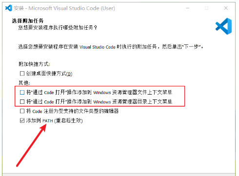
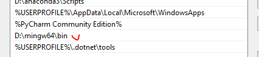
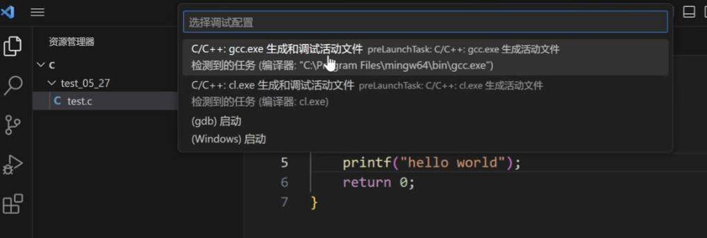
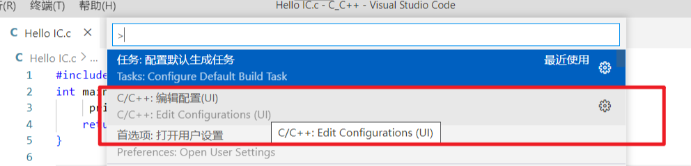
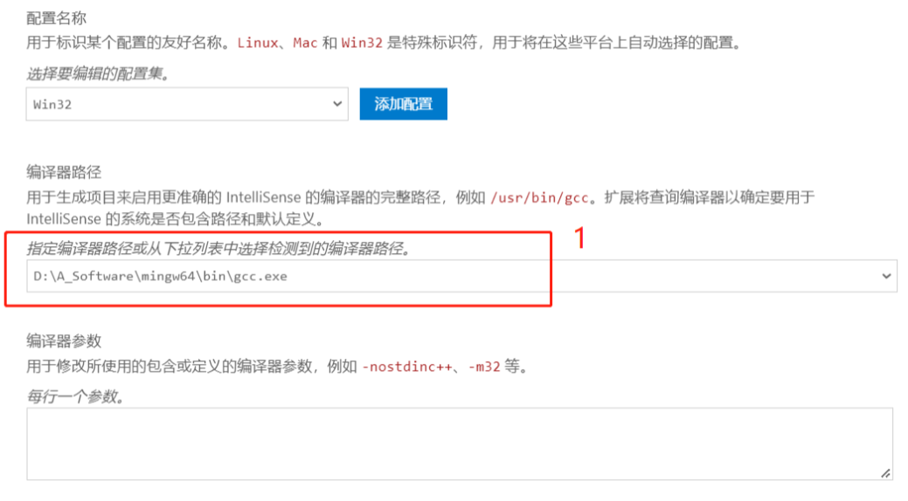
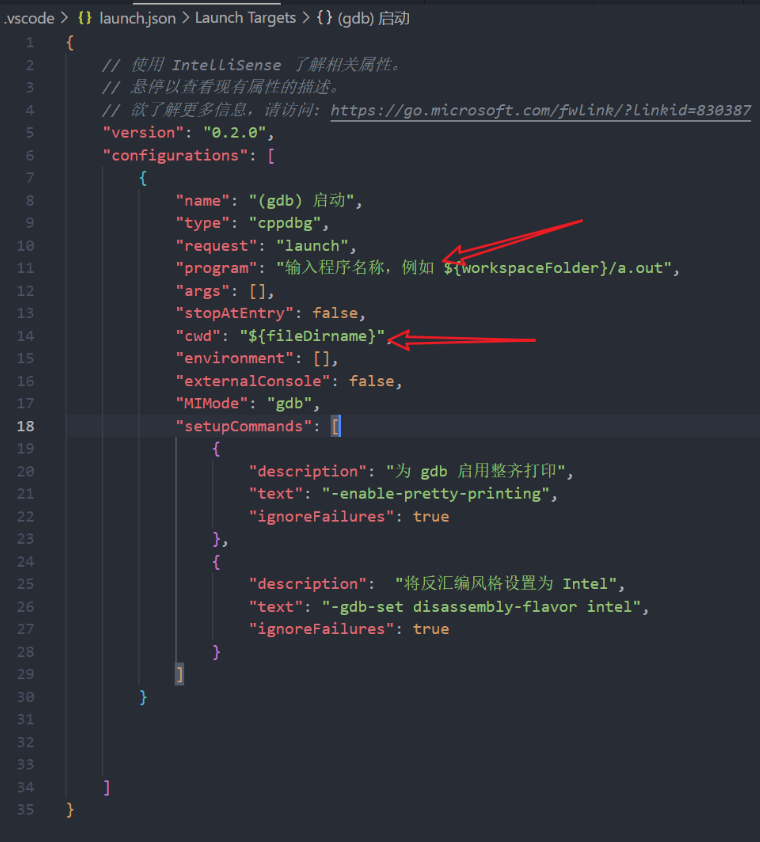
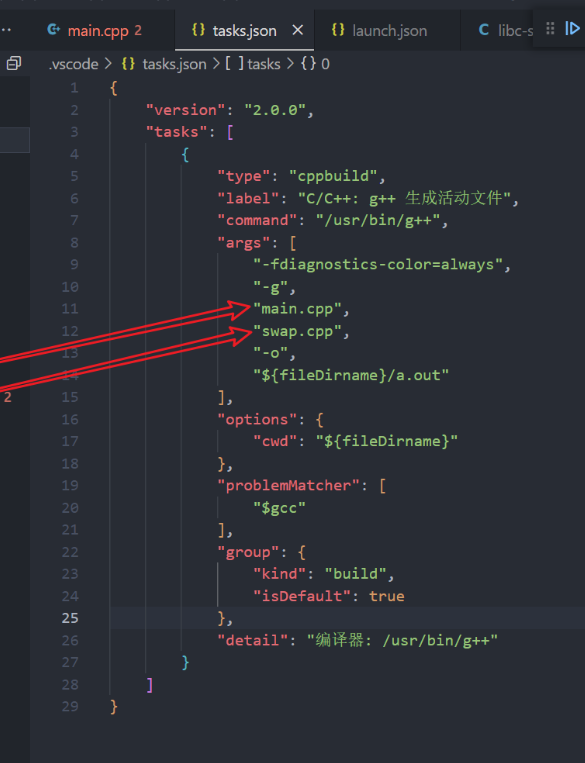

# Visual Studio Installation and Config

The document describes how to set up the VSC for C++ environment.  

## 1 Download VSC
* Download the [installer](https://code.visualstudio.com/) and follow the steps to install the VSC.  
   
Make sure that the VSC bin path is added to the system variable.  
* Install C/C++ plugin, recommended to install the extension package which also contains the C/C++ UI.

## 2 Compiler
* We use [MinGW](https://sourceforge.net/projects/mingw-w64/files/mingw-w64/mingw-w64-release/), here we choose the
"x86_64-win32-seh"; Download and extract the folder. 
* Add the path of the mingw64 bin to the system variable; Image below is an example:  
   
* We will use te gcc.exe in the bin folder as our compiler.  

## 3 Setup VSCode Environment  
1. We could create a new folder(with a C++ test code) and open with VSCode.  
2. Go to c/C++ UI to configure settings: (1) path to the compiler, (2) compilation parameters:    
     
  

The above settings is an example. The path in red rectangle should be the path to the gcc.exe under the mingw64 bin on
the local machine.  
<i>I also add -lstdc++ in the parameter bar.</i>
3. We need to set up tasks.json and launch.json under the same folder. Below two images are examples to these two json files.    
   
   
[For further information](https://blog.csdn.net/weixin_55334020/article/details/134442270)  
