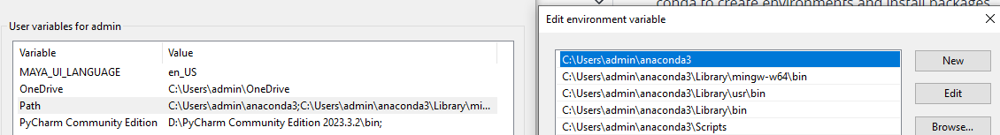
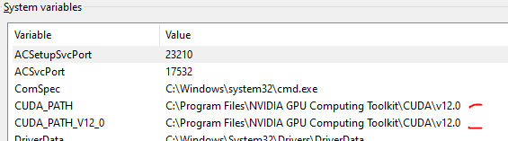
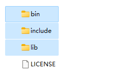
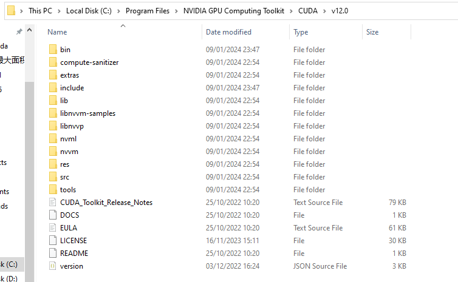
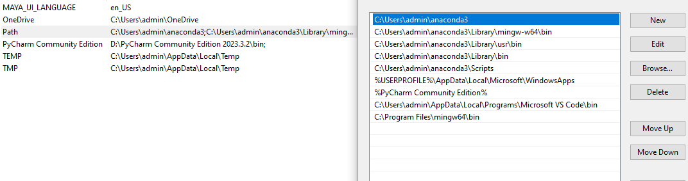
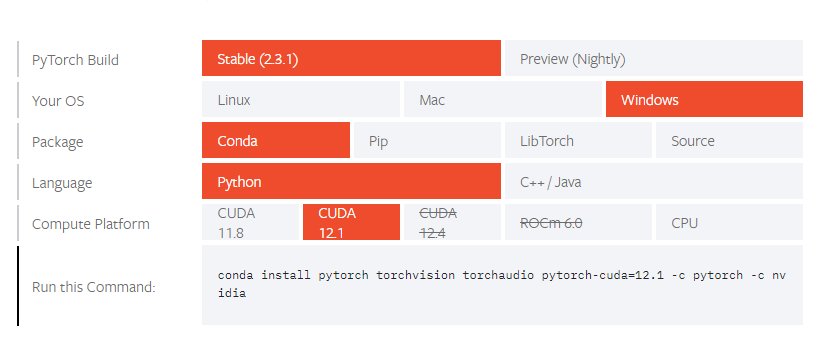
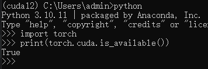

# Pytorch Cuda Environment Setup

The document describes the method to set up GPU Pytorch environment with Cuda12 and Anaconda.  

## 1. Conda  
Conda is a package and environment management tool. There are similar tools such as Pyenv. From personal experience,
if were to download package, I would choose conda instead of pip, the package pulled by conda seems to be more complete
than pip.   
For work with Riot, Pyenv is the go-to choice. I might write a note someday regarding Pyenv setup.  
There are circumstances that we have to use pip. For example, within the Mayapy for Autodesk Maya, or when 
sometimes a certain package could only be pulled by pip(conda or conda-forge does not have the package).  

The download page and beginner intro for conda is: 
[Getting started with conda](https://conda.io/projects/conda/en/latest/user-guide/getting-started.html).  

Note that we need to add the absolute paths for conda to the environment variable(in case the installer failed to do 
so); Below image is an example:    
  

Commonly-used Commands:
* `conda create -n` create a new environment；
If you need to specify python version when creating, `conda create -n env_name python=<version>`。
Python 3.10.11 works with cuda12 and other packages best on my machine,
so the command would be `conda create -n env_name python=3.10.11`.
* `conda info --envs` list of all environments.
* `conda activate env_name` change your current environment back to specific environment.  

## 2. Cuda12 Setup  
* Download the cuda12 from the [official website](https://developer.nvidia.com/cuda-12-0-0-download-archive).
* Check if the path has been added to the system variable:  
    
* To test if Cuda12 and cuDNN have been installed successfully: run `nvcc --version`. Run `set cuda` to check the system 
variable.
* Download [cuDNN](https://developer.nvidia.com/rdp/cudnn-archive) with the associated version. 
Copy three folders from the downloaded files(image 1), and paste them to the 'NVIDIA GPU Computing Toolkit\CUDA\v12.0'
directory(image2).    
  
  
* Add 4 paths to the system variable:  
  

## 3. Pytorch  
Go to the [official website](https://pytorch.org/get-started/locally/), choose the correct version, and copy the 
generated command. Run the command under the conda environment we set up earlier.   

To test if the torch-GPU is installed successfully:  
   

# Pytorch Cuda Environment Setup(NCCA) and Linux Bash  
## 1. Linux Bash
Some bash settings for logging in:  

`touch ~/.profile` the dot suggests a hidden file, normally configuration files. We difine commands that runs everytime when log in in this file, so these are essentially login prompt.  

`source ~/.profile` refresh with updated profile.   

`mv ~/.profile ~/.bash_profile` rename profile to bash_profile just in case the previous few steps not working due to the system not reading the profile. There can be also because the system is reading bashrc only so that we can also do `mv ~/.bash_profile ~/.bashrc`.  
In above file:  
`export PS1="[\u@\h \W]\$"`  
`\u`: user, `@\h`: at current host, `\W`: current desktop;  

In terminal -> pref -> command, enable "run command as a login shell".  

## 2. PyEnv and Anaconda
There is a shell script(install_python.sh) provided by the department(usual install could follow the official git repo).  

The shell script builds the pyenv at `.pyenv/`, use `python -V` for querying version.   
`pyenv versions` for querying software versions installed on the local machine; `pyenv version` is the current python version.  

`pyenv install --list` lists the python and modules that can be installed.    
`pyenv install --list | rg anacon`: list with softwares with anacon(for more accurate research); `|` is for joint commands.  

### Install anaconda with PyEnv  
`pyenv install anaconda3-2024.06-1`(or whichever version needed).   

`pyenv global anaconda3-2024.06-1` goes into the anaconda env.  

`jupyter-qtconsole &` could open the conda console in which both terminal command and python commands could be used. 

# Pytorch Cuda Environment Setup on Windows with Pyenv-Win
1. Install pyenv from power shell. [See instruction](https://github.com/pyenv-win/pyenv-win).
   Make sure the system variable is added.
2. Go to `~/.pyenv/pyenv-win/versions` and manually use the anaconda installer to install the conda in such folder.
   If the pyenc has already defined a local or global version, one can choose to install anaconda with such settings. Do not add anaconda to the environment variable path since it may conflict with the pyenv.
3. Open anaconda prompt and `conda init powershell` to enable conda commands in windows powershell. 
4. Reopen powershell, `pyenv local anaconda3`(anaconda3 can be changed based on the conda you installed, e.g.miniconda).
5. The above steps should enable conda in powershell and alongside pyenv. Can use conda-executable programs such as `jupyter notebook` and any other conda commands to test if the configuration works.

