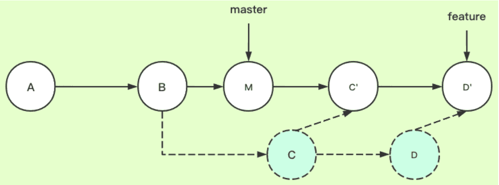

# Common Git Commands

1. `git status` 查看状态
2. `git branch` 列出所有的branch以及当前所在的branch
3. `git checkout` 转到某一个branch
4. `git checkout -b`   
新建一个branch; 一般来说新建后面跟`git remote add origin` 或者`git push --set-upstream origin (新建branch名)`
5. `git rebase` 
一般有两种使用情况; 
* 情景1: 

举例：我们希望将从B出来的分支C和D的变化切换到master上。
注意：尽量使git history呈线性，这样更加整洁，而且例如git-p4这样的插件在非线性log的情况下会异常；
在这种情况下，运行`git checkout C`，然后运行`git rebase master`。
下图是运行以上命令后的图例：  
  
在以上的rebase过程中，很可能会出现branch版本间的冲突；需要根据实际的命令行提示去solve conflicts;常见的命令行有：`git rebase 
--continue/skip/abort`。
记得把所有solve完的文件进行`git add .`。
小技巧：先将分支上的commits压缩(见情景2)成1个再去rebase,这样可以少solve几次conflicts。  

* 情景2：是git修改历史的一种方式
`git rebase -i Head^3`is to compress the latest 3 commits into 1;
One could also use the commit number such as `git rebase -i a5f4a0d`；
注意除了a5f4a0d是squash(s),其他commit都应该是pick(p)。

6. `git merge` 合并；一般合并前可以先做`rebase`，这样可以简化solve conflicts。完成合并后通过`git push -ff`push到remote。
7. `git push -ff`强行push;慎用!
8. `git reset`回滚；  
  
和`rebase -i`一样，可以用`Head^`也可以直接使用commit编号。
9. `git log` 查看git历史的方式